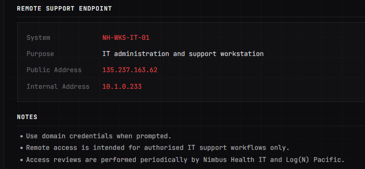
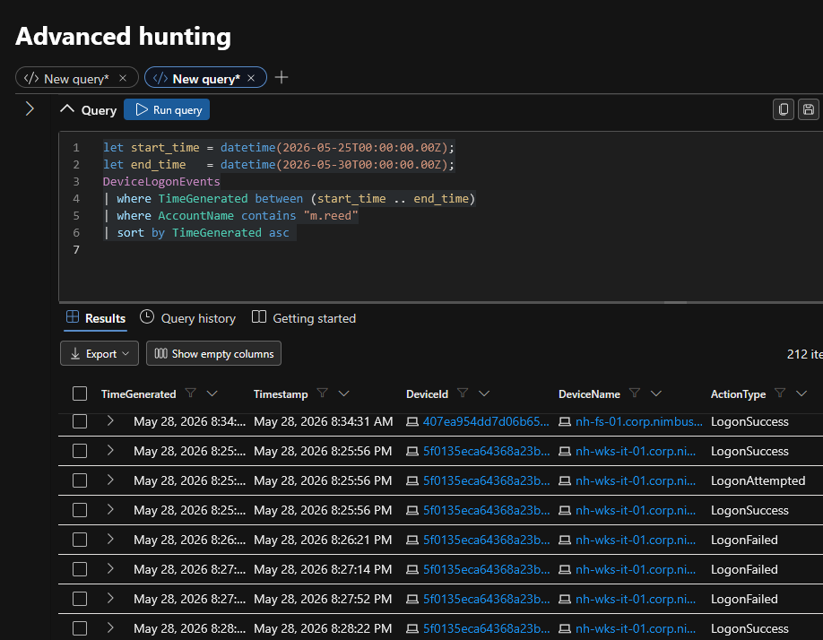
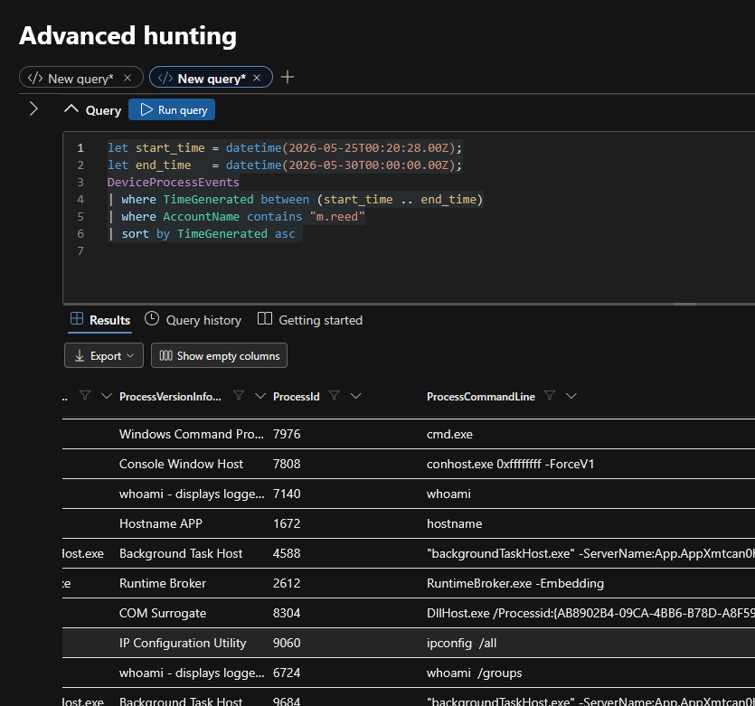
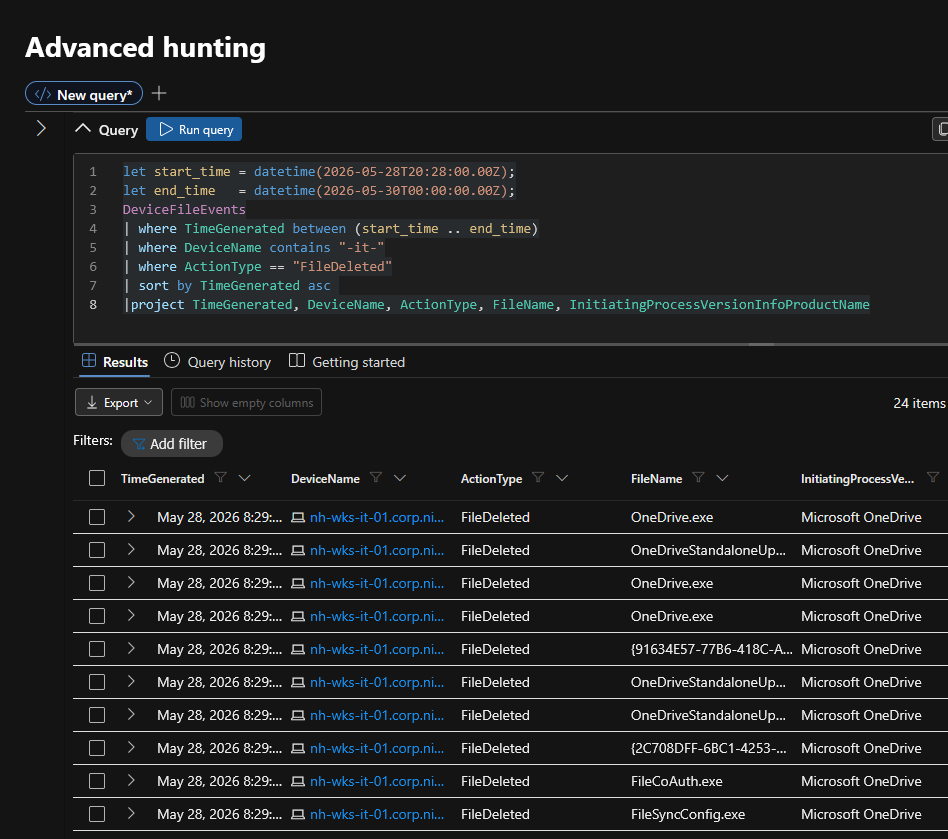
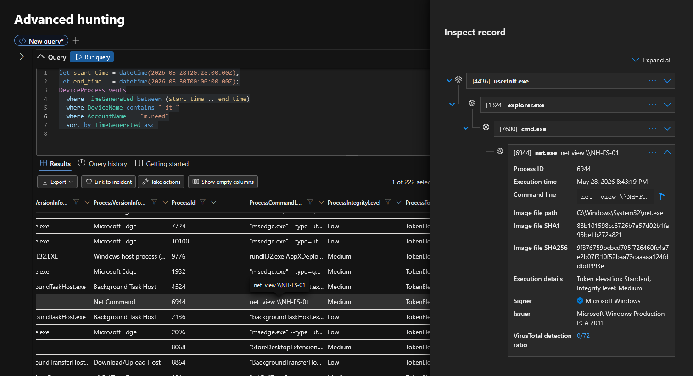
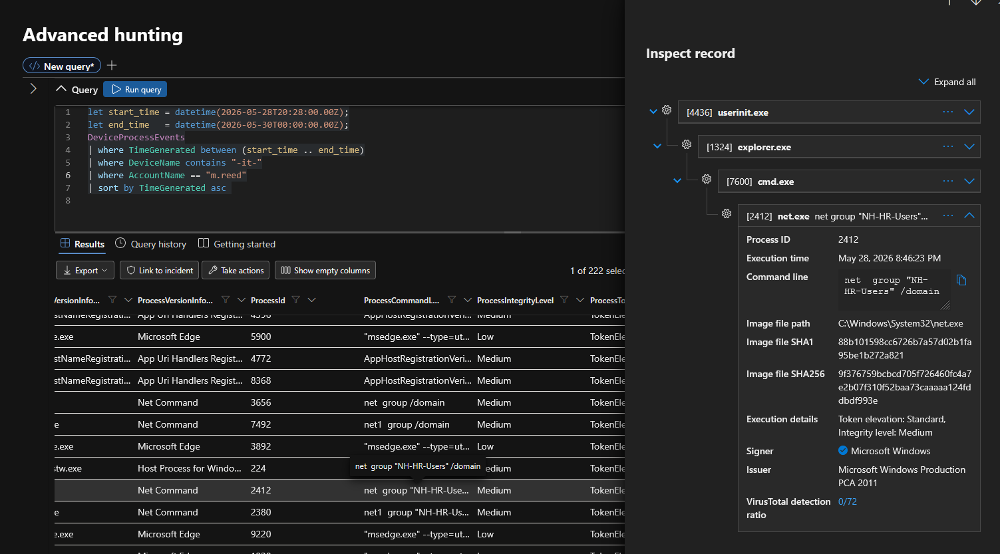
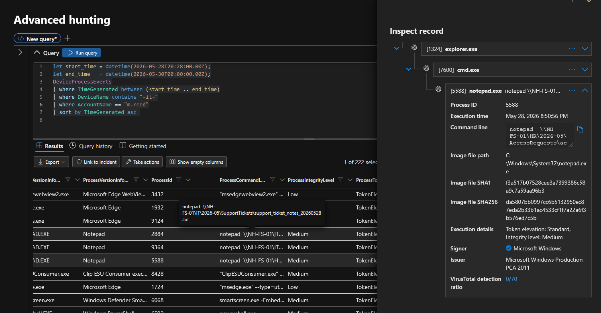
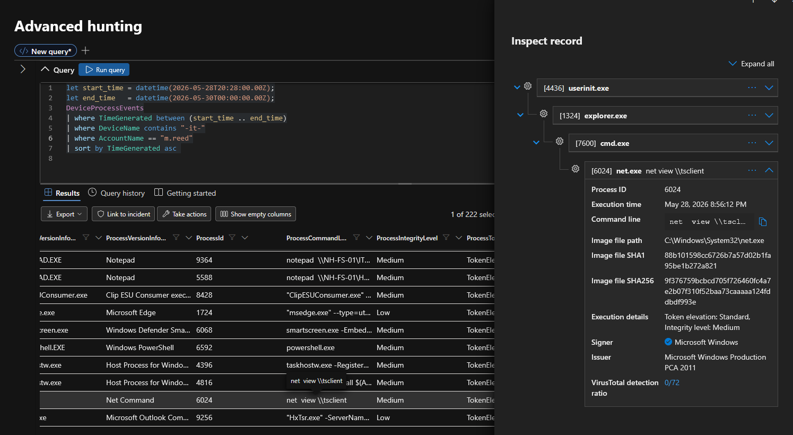
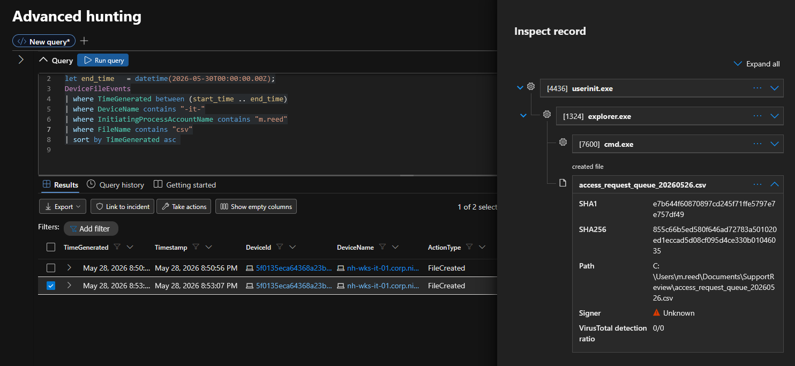
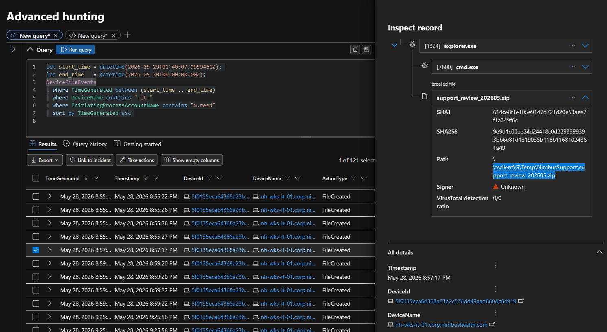

# ANOTHER DAY, PART TWO — Threat Hunt Write-Up

## At a glance

| | |
| --- | --- |
| **Hunt** | ANOTHER DAY, PART TWO |
| **Platform hunt #** | 14 |
| **Platform** | The Cyber Range — hunt.lognpacific.com |
| **Format** | CTF-style, 25 flags |
| **Date completed** | 2026-09-07 |
| **Time spent** | ~2 hours |
| **Score / rank** | 2455 points, 38th solve. |
| **Status** | Archived/practice hunt. Does not count toward the internship's technical bar — those are gated on a *live, time-limited* Community Threat Hunt, which this isn't. |

> **Environment note:**
> - Practice/archived CTF-style hunt on a public training platform, not a live graded assessment or production environment.

> **AI Assistance:**
> - **Hunt-solving:** No AI assistance was used.
> - **Write-up:**  All content was written by me. AI provided the format and structure.  Any use of AI will be noted.

## Scenario

A breach was discovered involving an employee's credentials. The company initially wanted to label it as a "curious employee" exploring. However, evidence led to the conclusion that an external threat actor had gained access and exfiltrated stolen data.

The first data point that suggested this was an external attack was the remote access source.  If this were just a "curious employee" scenario, this would have been done from an internal endpoint.

The second data point that pointed towards an external actor were the failed logon attempts.  The failed attempts were minimal (<5) before they gained access.  This was not a brute force attack nor a password spray.   This was targeting a specific employee with specific credentials.

Once they gained access the attacker conducted a minimal survey to get their bearings - whoami, hostname, and ipconfig. They checked the identity of the account and the groups it was assigned to.

The attacker then copied a file that was within their security group and staged it in a separate directory. They then added the compromised account to the HR group and moved laterally via SMB to the HR server.

The attacker copied another file to the staging area.

The attacker zipped the files into an archive and then moved the files off the Nimbus estate.

There is no evidence that persistence was added nor that any new accounts created.  No services or scripts were created to establish persistence.

Given the attack chain, this suggests that the company's initial assumptions were wrong.  Additionally, sensitive data was removed.

Also, the HR data likely contained PII (personally identifiable information) which should trigger a disclosure process.

From the Review Brief:

From: Hunt Lead // Cyber Range SOC

To: Threat Hunt // On-Shift

Re: Nimbus Health // credential exposure follow-up

You know this client. Nimbus Health, the outpatient clinic we picked apart back in March. They are back on the board, and this time the shape of the problem is different.

A nearby industrial park opened. Patient volume went up, and so did billing, HR onboarding and endpoint support. Nimbus hired across every department at once and put the new starters on the same shared workstations they already had. Growth first, access review later.

During a routine credential exposure sweep we flagged one of those new hires. His identity is sitting in public, and so is an old password of his. In the same period, authentication telemetry on one of their machines shows failed logons against that account, then a success.

What we need you to work out:

   · How the account was found and why it was worth targeting
   · Whether the credentials were actually used, and from where
   · What happened once someone was on the keyboard
   · What the account reached outside its role, and where that material went
   · Whether anything was left behind, and the honest root cause

Telemetry is in the law-cyber-range Sentinel workspace, MDE tables: DeviceLogonEvents, DeviceProcessEvents, DeviceFileEvents, DeviceEvents. This one starts outside the SIEM, though. Some of the earliest answers are not in any log, they are in what the internet already knows about this man. Work the artefacts below before you write your first query.

## Environment & tools
| Data source / tool | Used for |
|---|---|
| "Evidence Bag"  | Background information  |
| SIEM (Microsoft Defender/Sentinel) | KQL querying logs  |

## Approach

### The hunt begins

Based on the brief, I started by reviewing the "evidence bag".  In this were 4 artifacts:

- A snapshot of the employee's LinkedIn page
- A snapshot from haveibeenpwned.com
- A snapshot of Nimbus Health Security Operations
   - A User Role Matrix for all employees of Nimbus Health
   - Network Environment table with servers, workstations and shared storage information
      - Domain, Public and private IP addresses, NetBIOS Domain
- A snapshot of an internal IT document that "found its way into a public document cache"

This information gave me a sense of who was targeted, how the credentials were obtained, and how the attacker knew where to use the credentials.

### Getting the lay of the land

Moving into the SIEM I began by narrowing to the time frame and the targeted employee.

Everything looked like normal logon events except for a short round of 3 failed login attempts in a row.  Also these were attempts from a RemoteIP.

This is where it started to look more like an external attack than an internal "curious employee".  One thing that seemed odd was that the IP addresses of the attacker changed after a short break.  

I then checked to see what the attacker did once they had access.

It appeared the attacker was just getting their bearings with _whoami, hostname, ipconfig,_ and _whoami /groups_

In the midst of this was a random file deletion, but it turns out that it was just auto-update process for OneDrive. 

 

So there's no evidence that the attacker destroyed anything on the _nh-wks-it-01_ endpoint.

### Gathering Files

At this point, the story I am putting together is of an external actor using information gathered from various sources and has gained access.  Now I need to establish what the attacker was going to do with that access.

Pivoting to _DeviceProcessEvents_, I started looking for their actions. 

First, a query to _\\\\NH-FS-01_ 

Then they add the account to the _NH-HR-Users_ group

And then they open a series of files in Notepad

And then established a connection for file transfers.

That gives a sense of what they were looking at and doing.  Next I wanted to see what they did with the files from _\\\\NH-FS-01_ and adding the account to the _HR-Users_ group.

Pivoting to DeviceFileEvents, I start to search broadly but there's too much noise.  654 files created by "m.reed". That was when I remembered that one of the files that was opened in Notepad was a CSV file.  Narrowing the search to filenames containing CSV gave me 2 hits.  Crucially, this also gives me a timestamp to narrow my search.

Interestingly, this search also gave me a new local folder where a copied file was stored.

This narrowed the results to 121 files.  But there's something new here: _support\_review\_202605.zip_. So the attacker created a ZIP archive of files. And then transferred it out of the workstation and to their local computer.

### Putting together The Story

Now we have a much more complete story:
- An attacker used credentials assembled from OSINT
- Access was established through a Remote Desktop session
- The attacker gathered multiple files
- The files were zipped into an archive
- The archive was moved out of the Nimbus Health estate

This was likely an attack of opportunity. I did not find evidence of establishing persistent access nor did I find evidence that any files were deleted and no effort was made to cover the trail.

### The Aftermath

#### Isolation and Containment

In this case, the endpoint that was accessed needs to be isolated until the weaknesses can be addressed.

Remediation will need to go beyond just resetting the credentials. Because this breach was conducted by RDP, changing the password doesn't stop access - sessions are not automatically reset with a password reset.
The account will need to be rebuilt from scratch with new credentials in order to invalidate the RDP session.

#### Data Exfiltration (PII)

One of the files that were obtained from the HR server likely contained PII (personally identifiable information).  This will likely necessitate some kind of breach disclosure.

## Flags

| # | Objective (what it asked for) | Technique | Answer / evidence |
|---|---|---|---|
| 0 | Acknowledge the brief's scope — workspace, host, and time window — by giving the gate phrase from the brief. | Evidence Review | [REDACTED] |
| 1 | Name the Nimbus account under review, using the role matrix to identify who joined recently. | Evidence Review | m.reed |
| 2 | Find the account holder's public professional profile and give the job title exactly as listed. |Evidence Review | IT Support |
| 3 | From the same profile, give the personal (non-work) contact email address listed. | Evidence Review |mason.reed@hotmail.com  |
| 4 | Run that email through a breach-exposure service; identify which breach hit is stale vs. which one actually explains a reusable, current password, and why. | Evidence Review | Synthient, email addresses and passwords  |
| 5 | From a leaked internal support document, identify the public IP address of the machine that accepts remote support connections. | Evidence Review |135.237.163.62  |
| 6 | Out of constant internet-wide noise hitting the host, isolate the one external IP guessing low-volume and specifically against this account until it succeeds. | DeviceLogonEvents  KQL query | 116.45.242.115   |
| 7 | Give the Windows logon type name (not the numeric ID) for the successful logon, showing it wasn't an interactive/local session. | DeviceLogonEvents  KQL query | RemoteInteractive|
| 8 | Identify the second external IP the same account authenticated from a short time after the first successful logon. |DeviceLogonEvents  KQL query | 45.131.194.61 |
| 9 | Reconstruct, in order, the exact burst of built-in recon commands the operator ran once on — filtering out unrelated Windows/Edge first-run noise. |DeviceLogonEvents  KQL query | whoami, hostname, ipconfig /all, whoami /groups|
| 10 | Determine whether a file-deletion event inside that command burst was the operator or an automated process, and name what's actually responsible. | DeviceLogonEvents  KQL query | not the actor, onedrive auto update |
| 11 | Give the exact command used to enumerate what a specific file server was sharing. | DeviceLogonEvents  KQL query | net view \\\\NH-FS-01 |
| 12 | Give the exact command (with the real group name from the log, not an assumed naming convention) used to enumerate membership of the HR group. |DeviceProcessEvents KQL query| net group "NH-HR-Users" /domain |
| 13 | Name the file — outside the account's authorized IT share — that was opened after reaching across departmental boundaries. |  DeviceProcessEvents KQL query|access_request_queue_20260526.csv |
| 14 | Give the full local folder path where the operator staged gathered files before moving them. | DeviceFileEvents KQL Query |C:\Users\m.reed\Documents\SupportReview\ |
| 15 | Name the archive file (with extension) the staged material was compressed into. | DeviceFileEvents| support_review_202605.zip |
| 16 | Trace the archive to determine it left over the existing session (not upload/cloud) and give the destination path it was written to. | DeviceProcessEvents KQL Query |\\\\tsclient\G\Temp\NimbusSupport\ |
| 17 | Determine from scheduled tasks, services, and autoruns whether the operator established persistence, and account for what any entries found actually are. | DeviceFileEvents, DeviceProcessEvents KQL Query | no persistence. legitimate activity |
| 18 | Determine whether the account ever executed anything on the file server itself, and if not, explain how the HR material was actually reached. | DeviceFileEvents KQL Query | no execution. SMB access  |
| 19 | Give the honest overall read of the incident — who was really driving the account and from where — and what's absent from the evidence that rules out both malware and a genuine curious insider. | DeviceFileEvents, Evidence Bag, DeviceProcessEvents | External sources, valid credentials, native Windows tools throughout, no malware, no exploitation. |
| 20 | Prove the logon pattern is credential reuse from the identified breach rather than brute force, citing the failure count, the success, and why the breach data explains it. | DeviceLogonEvents | Three failed logons then a success is the signature of trying a small number of known-good password variants from the breach — not brute force, which would show hundreds of failures with no hit  |
| 21 | Explain the ~10-minute gap between the first and second command bursts — what changed at the start of the second session. | DeviceLogonEvents | A second RemoteInteractive logon from 45.131.194.61 appears at the start of the gap |
| 22 | Give the exact command the operator ran to check what was available through the RDP channel before exfiltrating, proving premeditation over opportunism. | DeviceProcessEvents | net view \\\\tsclient |
| 23 | State the first containment action required and why a password reset alone is insufficient given how access was obtained. | DeviceLogonEvents |RDP is still open. disable the account. password is from a public breach |
| 24 | Identify the type of data exfiltrated and what regulatory/disclosure obligation its exposure triggers. | DeviceFileEvents |PII was exfiltrated. That triggers a disclosure. |

> AI was used to create the table and pull data in for the Objective section. All other content was written by me.

## Sticking points & retrospective

There were a few places where the answers didn't parse "quite right".  This made me question my conclusions but it was usually just a problem with formatting or terminology. I had to burn some hints to get the right formatting to get past the gate.

Example: 

>**My answer:** whoami.exe, hostname.exe, ...  
> **"Correct" answer:** whoami, hostname, ...

## Skills & techniques demonstrated

- Connecting OSINT to SIEM data
- Pivots across multiple tables with KQL
- Evidence-based review against the hypothesis
- False-positive triage
- Signal/Noise reduction
- Attack Chain Reconstruction
- ATT&CK mapping
- Incident Response beyond detection

## MITRE ATT&CK mapping

| Scenario Step |Tactic | Technique |
|---|---|---|
| Finds employee's LinkedIn post about new IT job| Reconnaissance (TA0043)|T1593.001 – Search Open Websites/Domains: Social Media |
|Correlates employee to a prior breach dump |Reconnaissance (TA0043) |T1589.001 – Gather Victim Identity Info: Credentials |
|Logs in via RDP using the breached password |Initial Access (TA0001) |T1133 – External Remote Services + T1078 – Valid Accounts |
|Gathers files (first pass) |Collection (TA0009) |T1005 – Data from Local System |
|Adds self to HR group |Privilege Escalation / Persistence (TA0004/TA0003) |T1098.007 – Account Manipulation: Additional Local or Domain Groups |
|Moves to HR server via SMB |Lateral Movement (TA0008) |T1021.002 – Remote Services: SMB/Windows Admin Shares |
|Gathers more files on HR server |Collection (TA0009) | T1039 – Data from Network Shared Drive|
|Zips files |Collection (TA0009) |T1560.001 – Archive Collected Data: Archive via Utility |
|Copies to directory, pulls out via RDP mapped drive |Exfiltration (TA0010) |T1041 – Exfiltration Over C2 Channel (RDP session used as the exfil channel via drive redirection) |
> AI assistance note: I provided the attack chain information to AI which mapped each item to the MITRE ATT&CK framework.
---

_Part of [homelab-and-portfolio](../../README.md)._
