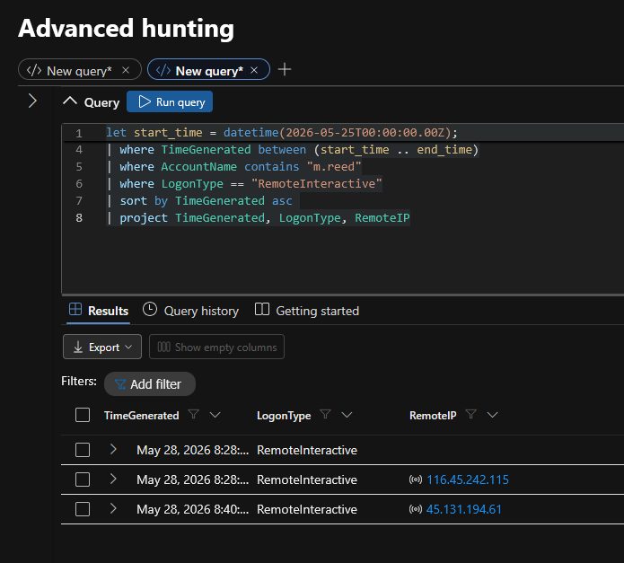

# ANOTHER DAY, PART TWO — Threat Hunt Write-Up

## At a glance

| | |
| --- | --- |
| **Hunt** | ANOTHER DAY, PART TWO |
| **Platform hunt #** | 14 |
| **Platform** | The Cyber Range — hunt.lognpacific.com |
| **Format** | CTF-style, 25 flags |
| **Date completed** | 2026-09-07 |
| **Time spent** | ~2 hours |
| **Score / rank** | 2455 points, 38th solve. |
| **Status** | Archived/practice hunt. Does not count toward the internship's technical bar — those are gated on a *live, time-limited* Community Threat Hunt, which this isn't. |

> **Environment note:**
> - Practice/archived CTF-style hunt on a public training platform, not a live graded assessment or production environment.
> ---
> **AI Assistance:**
> - **Hunt-solving:** No AI assistance was used.
> - **Write-up:**  All content was written by me. AI provided the format and structure.  Any use of AI will be noted.

## Scenario


A breach was discovered involving an employee's credentials. The company initially wanted to label it as a "curious employee" exploring. However, evidence led to the conclusion that an external threat actor had gained access and exfiltrated stolen data.

The first data point that suggested this was an external attack was the remote access source.  If this were just a "curious employee" scenario, this would have been done from an internal endpoint.

The second data point that pointed towards an external actor were the failed logon attempts.  The failed attempts were minimal (<5) before they gained access.  This was not a brute force attack nor a password spray.   This was targeting a specific employee with specific credentials.

Once they gained access the attacker conducted a minimal survey to get their bearings - whoami, hostname, and ipconfig. They checked the identity of the account and the groups it was assigned to.

The attacker then copied a file that was within their security group and staged it in a separate directory. They then added the compromised account to the HR group and moved laterally via SMB to the HR server.

The attacker copied another file to the staging area.

The attacker zipped the files into an archive and then moved the files off the Nimbus estate.

There is no evidence that persistence was added nor that any new accounts created.  No services or scripts were created to establish persistence.

Given the attack chain, this suggests that the company's initial assumptions were wrong.  Additionally, sensitive data was removed.

Also, the HR data likely contained PII (personally identifiable information) which should trigger a disclosure process.


<details>
<summary>From the Review Brief:</summary>

From: Hunt Lead // Cyber Range SOC

To: Threat Hunt // On-Shift

Re: Nimbus Health // credential exposure follow-up

You know this client. Nimbus Health, the outpatient clinic we picked apart back in March. They are back on the board, and this time the shape of the problem is different.

A nearby industrial park opened. Patient volume went up, and so did billing, HR onboarding and endpoint support. Nimbus hired across every department at once and put the new starters on the same shared workstations they already had. Growth first, access review later.

During a routine credential exposure sweep we flagged one of those new hires. His identity is sitting in public, and so is an old password of his. In the same period, authentication telemetry on one of their machines shows failed logons against that account, then a success.

What we need you to work out:

   · How the account was found and why it was worth targeting
   · Whether the credentials were actually used, and from where
   · What happened once someone was on the keyboard
   · What the account reached outside its role, and where that material went
   · Whether anything was left behind, and the honest root cause

Telemetry is in the law-cyber-range Sentinel workspace, MDE tables: DeviceLogonEvents, DeviceProcessEvents, DeviceFileEvents, DeviceEvents. This one starts outside the SIEM, though. Some of the earliest answers are not in any log, they are in what the internet already knows about this man. Work the artefacts below before you write your first query.
</details>

## Environment & tools

> _What you were actually looking at — log source, PCAP, a simulated host, a SIEM query interface, whatever the platform gave you — and what you used to work it._

| Data source / tool | Used for |
|---|---|
| "Evidence Bag"  | Background information  |
| SIEM (Microsoft Defender/Sentinel) | KQL querying logs  |

## Approach

_The part a flag-by-flag list can't show: how you actually worked the problem. Order of operations, what you tried first and why, any pivot in strategy partway through. This is usually the most useful section for someone reading the write-up rather than grading it — it's the process, not just the answers._

### The hunt begins

Based on the brief, I started by reviewing the "evidence bag".  In this were 4 artifacts:

- A snapshot of the employee's LinkedIn page
- A snapshot from haveibeenpwned.com
- A snapshot of Nimbus Health Security Operations
   - A User Role Matrix for all employees of Nimus Health
   - Network Environment table with servers, workstations and shared storage information
      - Domain, Public and private IP adresses, NetBIOS Domain
- A snapshot of an internal IT document that "found its way into a public document cache"


This information gave me a sense of who was targeted, how the credentials were obtained, and how the attacker knew where to use the credentials.

### Getting the lay of the land

Moving into the SIEM I began by narrowing to the time frame and the targeted employee.

Everything looked like normal logon events except for a short round of 3 failed login attempts in a row.  Also these were attempts from a RemoteIP 


This is where it started to look more like an external attack than an internal "curious employee".  One thing that seemed odd was that the IP addresses of the attacker changed after a short break.  



I then checked to see what the attacker did once they had access.


It appeared the attacker was just getting their bearings with _whoami, hostname, ipconfig,_ and _whoami /groups_

In the midst of this was a random file deletion, but it turns out that it was just auto-update process for OneDrive. 

 {width=300 height=200}

So there's no evidence that the attacker destroyed anything on the _nh-wks-it-01_ endpoint.


## Flags

_A scan table for all 25, then deep-dives below for the ones actually worth narrating. Not every flag needs a paragraph — some are "grepped the log, there it was." Say so and move on. Save the depth for the ones that took real work._

| # | Objective (what it asked for) | Technique | Answer / evidence |
|---|---|---|---|
| 1 | | | |
| 2 | | | |
| … | | | |
| 25 | | | |

### Deep-dives

_Duplicate this block per flag worth a full narrative — a genuine sticking point, a wrong turn you had to back out of, a technique you hadn't used before, anything with a real "how did I get here" story. Same evidentiary discipline as the rest of the portfolio: show the reasoning, not just the answer._

#### Flag [#] — [short title]

**What it asked:**

[...]

**What I tried first (and why it didn't work, if it didn't):**

[...]

**What actually worked:**

[...]

**Evidence:**

```
[query, log excerpt, command output, whatever backs the answer]
```

## Sticking points & retrospective

>_Where you actually got stuck, what broke your assumption, what you'd do differently starting over. This is the section that reads as honest rather than a highlight reel — keep it that way._

There were a few places where the answers didn't parse "quite right".  This made me question my conclusions but it was usually just a problem with formatting or terminology. I had to burn some hints to get the right formatting to get past the gate.

Example: 

>**My answer:** whoami.exe, hostname.exe, ... <br>
> **"Correct" answer:** whoami, hostname, ...


## Skills & techniques demonstrated

_Bullet list, portfolio-reader-facing. What does this hunt actually prove you can do?_

- [ ]

## MITRE ATT&CK mapping _

| Scenario Step |Tactic | Technique |
|---|---|---|
| Finds employee's LinkedIn post about new IT job| Reconnaissance (TA0043)|T1593.001 – Search Open Websites/Domains: Social Media |
|Correlates employee to a prior breach dump |Reconnaissance (TA0043) |T1589.001 – Gather Victim Identity Info: Credentials |
|Logs in via RDP using the breached password |Initial Access (TA0001) |T1133 – External Remote Services + T1078 – Valid Accounts |
|Gathers files (first pass) |Collection (TA0009) |T1005 – Data from Local System |
|Adds self to HR group |Privilege Escalation / Persistence (TA0004/TA0003) |T1098.007 – Account Manipulation: Additional Local or Domain Groups |
|Moves to HR server via SMB |Lateral Movement (TA0008) |T1021.002 – Remote Services: SMB/Windows Admin Shares |
|Gathers more files on HR server |Collection (TA0009) | T1039 – Data from Network Shared Drive|
|Zips files |Collection (TA0009) |T1560.001 – Archive Collected Data: Archive via Utility |
|Copies to directory, pulls out via RDP mapped drive |Exfiltration (TA0010) |T1041 – Exfiltration Over C2 Channel (RDP session used as the exfil channel via drive redirection) |
> AI assistance note: I provided the attack chain information to AI which mapped each item to the MITRE ATT&CK framework.
---

_Part of [homelab-and-portfolio](../../README.md)._
