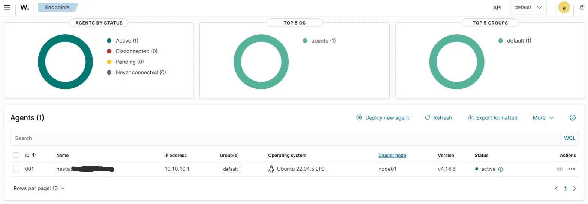

# Wazuh SIEM — Production Endpoint Monitoring over WireGuard

Deployed a Wazuh SIEM on a self-hosted hypervisor and onboarded a real,
internet-facing Linux host as a monitored endpoint — with the agent connecting
over a private WireGuard tunnel so the SIEM itself is never exposed to the
public internet.



## Objective

Stand up a working SIEM and get genuine telemetry flowing into it from a
production host — not a lab victim VM, but an actual internet-facing server I
already operate. The design goal was to do this *without* exposing the SIEM's
management surface to the internet, which ruled out the simplest approach
(port-forwarding the manager) from the start.

## Architecture

The manager runs on a home LAN behind NAT; the monitored host is a public VPS.
Rather than expose the manager, the agent reaches it through a WireGuard overlay:

```
   Public VPS (hestia)                    Home LAN (behind NAT)
  ┌────────────────────┐                ┌──────────────────────────┐
  │  Ubuntu 22.04 LTS  │                │  Proxmox VE (N95 mini PC) │
  │  Wazuh agent       │                │  ┌────────────────────┐  │
  │  wg0: 10.10.10.1   │◄──WireGuard───►│  │ Ubuntu 24.04 VM    │  │
  │  (WG listener,     │   encrypted    │  │ Wazuh manager      │  │
  │   public IP)       │    tunnel      │  │ wg0: 10.10.10.2    │  │
  └────────────────────┘                │  │ (dials out +       │  │
                                        │  │  keepalive)        │  │
        agent → manager                 │  └────────────────────┘  │
        traffic (1514/1515)             └──────────────────────────┘
        rides the tunnel only
```

- **Host:** Proxmox VE on bare metal (Intel N95, 16GB) — a type-1 hypervisor,
  no desktop-OS overhead, so RAM stays available for VMs.
- **Manager:** Wazuh 4.14 all-in-one (manager + indexer + dashboard) on an
  Ubuntu Server 24.04 LTS VM (6GB / 2 vCPU / 50GB).
- **Monitored endpoint:** a production Ubuntu 22.04 LTS VPS running the Wazuh
  agent.
- **Transport:** WireGuard point-to-point tunnel on the `10.10.10.0/24` range.

## Design decisions

**No inbound exposure of the SIEM.** The manager sits behind home NAT and can't
accept inbound connections — which is exactly the property I wanted. Instead of
forwarding the manager's ports to the internet, the public VPS acts as the
WireGuard *listener* and the manager *dials out* to it, holding the connection
open with `PersistentKeepalive` since it's the NAT'd side. Once established the
tunnel is bidirectional, so the agent can reach the manager without the manager
ever being publicly reachable.

**Tunnel scoped to avoid collateral impact.** `AllowedIPs` restricts the tunnel
to the `10.10.10.0/24` range, so bringing the interface up on a remote box over
SSH doesn't touch the default route or the live session — no risk of locking
myself out of the VPS.

**Defense in depth at the manager.** A host firewall rule (ufw) permits agent
traffic on TCP 1514–1515 *only* from the VPS's tunnel address (`10.10.10.1`),
not from the whole LAN. The agent path is the only path in.

**Full VM, not a container, for the manager.** Wazuh's indexer is OpenSearch,
which fights unprivileged LXC containers over memory-locking and kernel params.
A full VM sidesteps that entirely.

## Verification

The dashboard confirms the endpoint as **Active**, and — the detail that proves
the design — the manager sees it on `10.10.10.1`, its *tunnel* address, not its
public IP. The agent reached the manager entirely inside the encrypted overlay.

## What this demonstrates

- SIEM deployment end to end (manager, indexer, dashboard) and agent enrollment
- Endpoint telemetry ingestion from a real production host
- Secure network design: private overlay transport, no public exposure of
  management services, least-privilege host firewalling
- Hypervisor and Linux administration underpinning the whole build

## What's next

- Detection rules against the live traffic this host actually sees
- Folding in an internet-facing honeypot feed and additional endpoints
- File integrity monitoring and log analysis tuned to real activity
