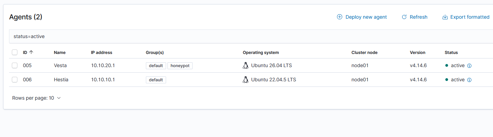

# Wazuh SIEM — Two Monitored Endpoints over Separate WireGuard Tunnels
>**AI assistance note**:  This case study was produced using AI as an exploration of what could be created using the equipment and servers available to me.  The ideas and objectives were mine while Claude was used to generate the process and help with troubleshooting.

A self-hosted Wazuh SIEM with two real internet-facing Linux hosts reporting
into it: a production VPS I operate, and a Cowrie honeypot. Both agents connect
over private WireGuard tunnels — **separate tunnels, not a shared one** — so the
manager is never exposed to the public internet and the honeypot has no network
path to production.



## Objective

Stand up a working SIEM and get genuine telemetry into it from hosts that see
real traffic — not lab victim VMs. The design constraint was to do it _without_
exposing the manager's management surface to the internet, which ruled out
port-forwarding the manager from the start. The second constraint arrived with
the honeypot: get attacker telemetry into the same SIEM without giving a
deliberately-exposed box any route to a production one.

## The estate

| Host | Role | OS | Resources | Agent groups |
| --- | --- | --- | --- | --- |
| Fornax | Wazuh manager (VM on Proxmox) | Ubuntu Server 26.04 LTS | 2 vCPU / 6GB / 64GB | — |
| Hestia | Production VPS | Ubuntu 22.04.5 LTS | 4 vCPU / 8GB / 100GB | `default` |
| Vesta | Cowrie honeypot (DigitalOcean VPS) | Ubuntu 26.04 LTS | 1 vCPU / 1GB / 25GB | `default`, `honeypot` |

Every spec above was read off the live host with `lsb_release -a` rather than
copied from these notes — this file previously carried the manager's OS and disk
wrong for four revisions because the documentation was believed over the machine.

- **Hypervisor:** Proxmox VE on bare metal (Intel N95, 16GB, NVMe) — type-1, no
  desktop-OS overhead, so RAM stays available for VMs.
- **Manager:** Wazuh 4.14.6 all-in-one (manager + indexer + dashboard on a single
  node). Automatic updates deliberately disabled; snapshots taken at clean
  install and at first agent connection.
- **Agents:** both 4.14.6, both Active, both reporting on their tunnel addresses.
  The honeypot's agent package is pinned with `apt-mark hold` — an agent must
  never end up newer than its manager.

## Architecture

The manager sits on a home LAN behind NAT. Both monitored hosts are public VPSes.
Rather than expose the manager, each agent reaches it through its own WireGuard
overlay, with the manager dialing **out** in both cases:

```
  Public VPS (Hestia)                Home LAN (behind NAT)              Public VPS (Vesta)
 ┌────────────────────┐         ┌──────────────────────────────┐      ┌────────────────────┐
 │  Ubuntu 22.04 LTS  │         │  Proxmox VE (N95 mini PC)    │      │  Ubuntu 26.04 LTS  │
 │  Wazuh agent       │         │  ┌────────────────────────┐  │      │  Wazuh agent       │
 │  wg0: 10.10.10.1   │◄──WG───►│  │ Fornax — Wazuh manager │  │◄─WG─►│  wg0: 10.10.20.1   │
 │  (WG listener)     │         │  │ wg0: 10.10.10.2        │  │      │  (WG listener)     │
 │                    │         │  │ wg1: 10.10.20.2        │  │      │  Cowrie on 2222    │
 └────────────────────┘         │  │ (dials out on both,    │  │      │  public 22 → 2222  │
                                │  │  PersistentKeepalive)  │  │      └────────────────────┘
   agent → manager              │  └────────────────────────┘  │        agent → manager
   1514/1515, tunnel only       └──────────────────────────────┘        1514/1515, tunnel only

   no route exists between 10.10.10.0/24 and 10.10.20.0/24
```

## Design decisions

**No inbound exposure of the SIEM.** The manager sits behind home NAT and can't
accept inbound connections — exactly the property I wanted. Instead of forwarding
its ports, each public VPS acts as the WireGuard _listener_ and the manager
_dials out_, holding the connection open with `PersistentKeepalive` since it's
the NAT'd side. Once established the tunnel is bidirectional, so an agent reaches
the manager without the manager ever being publicly reachable.

**Two tunnels, not a hub — and this is the load-bearing one.** The obvious build
was adding the honeypot as a third peer on the existing Hestia tunnel. I
rejected it: that makes Hestia a router between a machine deliberately exposed
to attackers and the production stack, which is a live network path across the
exact boundary the honeypot exists to preserve. The second tunnel runs on its own
subnet with its own keypair — no IP forwarding anywhere, no contact with
`10.10.10.0/24`, blast radius ending at the honeypot. Full rationale and the
residual risk are in the [honeypot write-up](../honeypot/README.md).

**`AllowedIPs` scoped to a single peer.** `/32` in both directions on the
honeypot tunnel. Beyond the isolation, it means bringing an interface up on a
remote box over SSH doesn't touch the default route or the live session — no
locking myself out of a VPS I can only reach over the internet.

**Least privilege at the manager's firewall.** ufw permits 1514–1515/tcp only
from `10.10.10.1` and only from `10.10.20.1` — each endpoint's tunnel address,
not the LAN. SSH and the dashboard are restricted to the LAN range. Default deny
inbound. The residual risk this addresses is specific: the Wazuh agent is the one
component touching both worlds, so if anyone escaped Cowrie to real root on that
box they'd inherit the tunnel config and the agent key. That host can reach
exactly two ports on one machine and nothing else.

**Full VM, not a container, for the manager.** Wazuh's indexer is OpenSearch,
which fights unprivileged LXC containers over memory-locking and kernel params.
A full VM sidesteps it.

## Verifying that the endpoints are actually feeding

The premise of this section is a lesson the build taught twice: **a green agent,
a loaded ruleset, and no errors is indistinguishable from a working pipeline and
a completely silent one.** Status reads do not close the question.

**Hestia** — Active, and the manager sees it at `10.10.10.1`, its
tunnel address, rather than its public IP. That is the detail that proves the
transport design: the agent reached the manager entirely inside the encrypted
overlay. Its telemetry lands in the `default` group's ruleset.

**Vesta** — verified end to end against a real unsolicited
attacker session rather than a synthetic test. A bot from `125.39.148.106`
(SSH-2.0-Go client, session `e62daa89a735`) hit public port 22; the NAT counter
incremented, Cowrie logged `cowrie.session.connect` with `dst_port 2222`, and on
the manager both `100101` and `100103` (`ACCEPTED login root/ubuntu`, level 10)
fired with `decoder.name: json`. **~255ms from Cowrie's log write to the manager
alert, across the tunnel.** The Cowrie ruleset those alerts came from was written
with AI assistance and is published in the [honeypot write-up](../honeypot/README.md).

**Two ways that chain has broken silently, both caught, both worth recording:**

1. **Enabling ufw on the honeypot severed its own ingest for about two hours.**
   The `22 → 2222` redirect lives in nat `PREROUTING`, which runs before the
   filter chain where ufw's rules live — so a rule naming port 22 never matches a
   packet whose destination has already been rewritten to 2222, and default-deny
   dropped it. The process was healthy, the agent read Active, the manager read
   connected, and no attacker traffic reached any of them. **The DNAT/filter
   ordering diagnosis came from AI assistance, stated as a prediction before any
   command was run; I ran the commands and read the output.** The fix was
   `allow 2222/tcp` plus `allow 51821/udp` — the second because the honeypot is
   the WireGuard listener, and the tunnel had been surviving only on a conntrack
   entry refreshed by keepalive.
2. **The honeypot came back from a reboot not collecting, and nothing announced
   it.** Cowrie had no systemd unit at all — not disabled, never created; it had
   been started by hand and died with the reboot. Nine minutes, measured from the
   last log write against `uptime -s`, and no capture was lost. **AI assistance
   read the NAT rule's packet count and proposed a hypothesis; I ran every
   command, and the actual cause turned out simpler than the hypothesis.** Fixed
   with a unit that invokes `twistd` by absolute path and keeps Cowrie's own file
   logger so log rotation survives.

**The standing rule both produced:** every control change on an internet-facing
host now ends with a live connection **from outside the box**, then a check that
the event reached the manager. Locally-generated traffic traverses nat `OUTPUT`
instead of `PREROUTING` and skips the redirect entirely, so a test run on the
host proves nothing — which is precisely how the first failure stayed invisible.

## Known gaps

Stated rather than left for someone to find:

- **SCA is doing nothing on the honeypot.** The shipped CIS policy targets Ubuntu
  22.04 and the host is 26.04, so it's skipped: `Skipping policy
  'cis_ubuntu22-04.yml': 'Check Ubuntu version.'` A green agent is masking zero
  configuration assessment on that box.
- **Rootcheck false positives on the honeypot are untuned.** `/usr/bin/date`,
  `/bin/md5sum` and `/usr/bin/md5sum` flag as "Trojaned version of file detected"
  — generic signature matching against legitimate modern coreutils. On a honeypot
  specifically this is the alert class that cannot be allowed to cry wolf, since
  it's how a real compromise gets scrolled past.
- **Three of the seven Cowrie rules have never been observed firing live**
  (`100102`, `100105`, `100110`). `100102` doesn't fire under test because Cowrie
  *accepts* the credentials offered — designed behavior, not a rule defect.
  `100110`'s 8-attempts-in-120s window was set from an assumption rather than
  from measured attacker pacing.
- **No detections are written against Hestia's own traffic yet.** It's enrolled
  and reporting; the rules so far are all honeypot-side.

## What this demonstrates

- SIEM deployment end to end (manager, indexer, dashboard) and multi-agent
  enrollment
- Telemetry ingestion from two live internet-facing hosts with different threat
  profiles
- Secure network design: private overlay transport, no public exposure of
  management services, per-peer scoping, least-privilege host firewalling, and
  network isolation between a deliberately-exposed host and production
- Verifying a pipeline by pushing a real event through it rather than reading
  status indicators
- Hypervisor and Linux administration underpinning the whole build

## What's next

- Measure real inter-attempt intervals from the capture and retune `100110` to
  observed pacing instead of an assumed window
- Scope the rootcheck tuning to the `honeypot` agent group so production keeps
  the check, and capture before/after
- Decide the SCA gap explicitly — fix the policy for 26.04 or accept it in writing
- Detections against Hestia's own log sources
